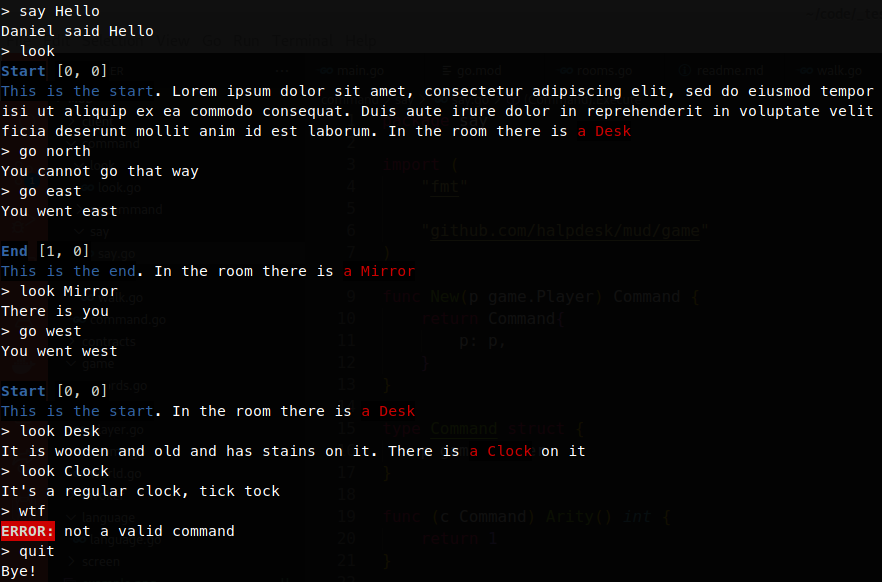
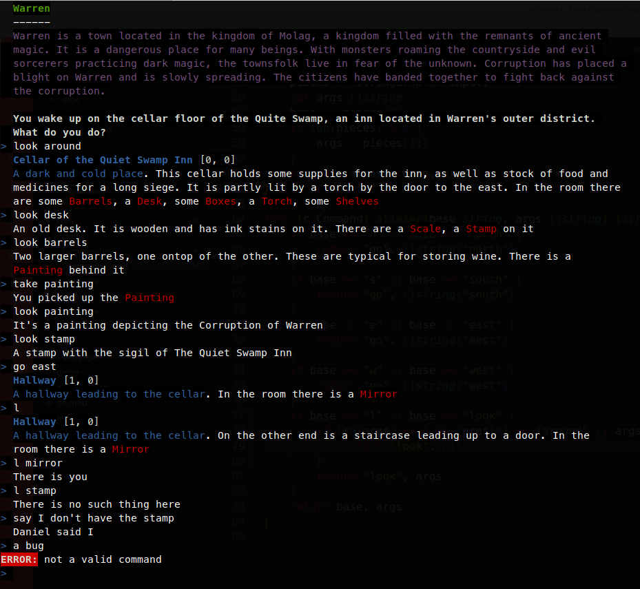

# A simple MUD by halpdesk

I am doing this mostly to learn stuff. Having a project that you can switch to beside work and
where you can test and apply patterns freely helps a lot in this regard.  
I chose to create a MUD, because I understand it from the perspective of a consumer. There are
many interesting patterns that needs to be taken into calculation and emerges in a MUD, for 
example command pattern to manage the input and commands from the player, and observer pattern
to manage asynchronous events that affects the player. Since MUDs are a multi-user system, it
also requires the programmer to apply secure mutexes to manage all asynchronous events in 
different go routines.  
  
Example day 1:
  
  
Example day 2:

### Resource

- https://perchance.org/room-description-gen
